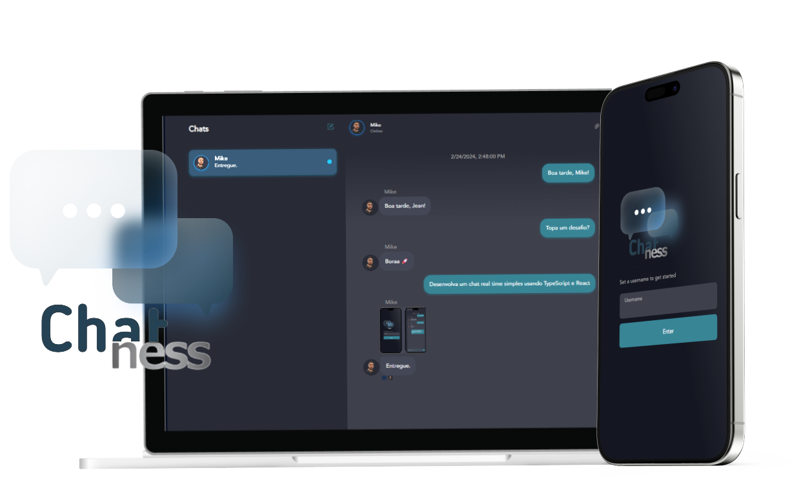

# ChatApp 💙 | feito com React Typescript

<p align="left">
    <p align="left" >
        
        </a>
    </p>
</p>

## 📚 Informações sobre o projeto.

- Aplicação web Full-Stack relacionado a vaga para desenvolvedor Node.js com React.
- A ideia é desenvolver um chat real time simples usando no front-end TypeScript e React com uso de libs.

&nbsp;

## 💻 O que tem no projeto?

- TypeScript no desenvolvimento do aplicativo
- Biblioteca React para construir a interface do usuário
- Consumo de API usando axios
- Pathing maping (alias para importação de arquivos)
- Projeto simples e estruturado
- Styled components

&nbsp;

## 🚀 Melhorias implementadas

- Layout Bonito e Intuitivo (UI/UX)
- Criação de salas para envio multiplos de mensagens
- Design incluindo versão responsiva
- Build do projeto (Deploy)
- Documentação

&nbsp;

<p align="left">
    <p align="left" >
        
        </a>
    </p>
</p>

## 🛠️ Tecnologias/Ferramentas ultilizadas

- [React](https://pt-br.reactjs.org/E)
- [Typescript](https://www.typescriptlang.org/)
- [Node.js](https://nodejs.org/en)
- [Express](https://expressjs.com/)

&nbsp;

<p align="center">
  <a href="https://chatness-web.netlify.app/" target="_blank">
    
  </a>
</p>

## 💻 Como usar o projeto

Para gerar uma cópia do projeto e implementar as suas melhorias, esteja em um computador com Node Js instalado e siga as etapas abaixo:

1º clone o projeto com o comando

```
git clone https://github.com/MikeFernando/chatness-web.git
```

2º Acesse a pasta do projeto pelo terminal com o comando

```
cd chatness
```

3 Instale as dependências necessárias com o comando

```
npm install
```

4 Rode o projeto com o comando

```
npm run dev
```
